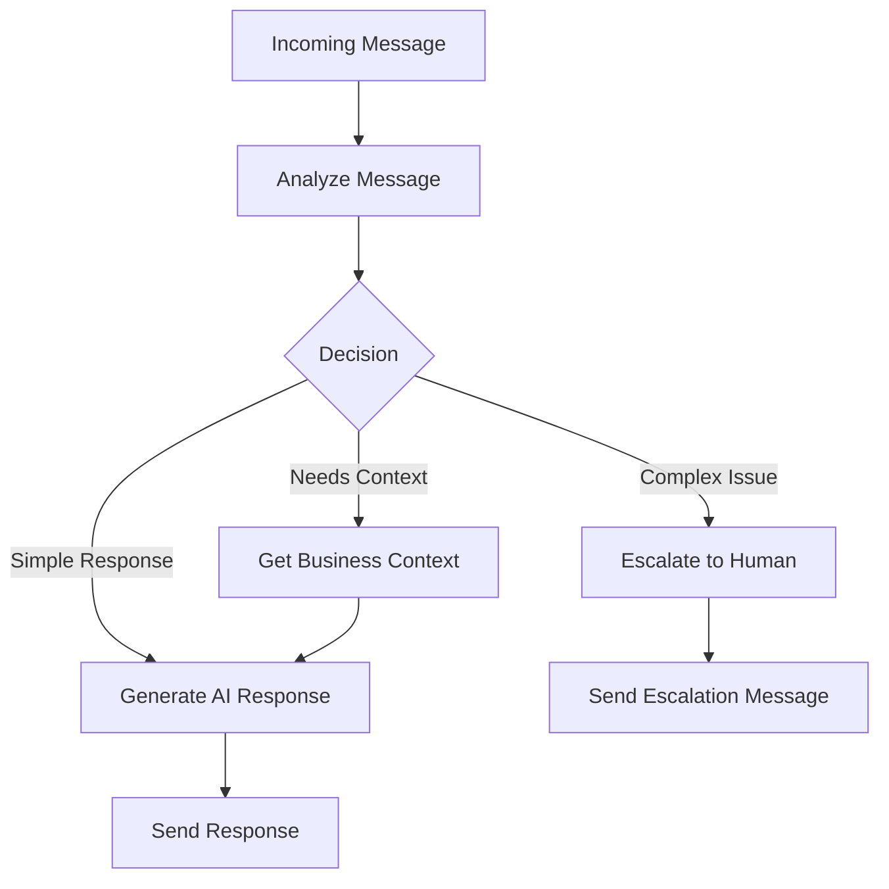

# WhatsApp AI Agent with LangGraph

An intelligent WhatsApp customer service agent that automatically decides whether to respond with AI or escalate to human support, powered by LangGraph and OpenAI.

## Features

### 🤖 AI Agent with Smart Decision Making
- **Intelligent Routing**: Analyzes incoming messages to determine if they need AI response, business context, or human escalation
- **LangGraph Workflow**: Uses a sophisticated state graph to process messages through multiple decision points
- **Business Context Integration**: Automatically retrieves and uses your business information for personalized responses
- **Conversation History**: Maintains context from previous messages for better responses

### 🧠 Decision Logic
The AI agent routes messages based on complexity:
- **Simple queries** (greetings, hours, location) → AI responds with business context
- **Business-specific questions** → Fetches business data first, then responds
- **Complex issues** (complaints, technical problems, orders) → Escalates to human with friendly message

### 📊 Database Integration
- MongoDB with proper indexing for performance
- Business details collection integration
- Conversation history tracking
- Outgoing message logging

## Setup

### 1. Environment Variables
Create a `.env` file with:

```env
# WhatsApp Configuration
WHATSAPP_VERIFY_TOKEN=your_webhook_verify_token
WHATSAPP_ACCESS_TOKEN=your_whatsapp_api_token
WHATSAPP_APP_SECRET=your_app_secret

# OpenAI Configuration
OPENAI_API_KEY=your_openai_api_key

# Database Configuration
MONGODB_URI=mongodb://localhost:27017/
DATABASE_NAME=whatsapp_saurus

# JWT Configuration
JWT_SECRET_KEY=your_jwt_secret_key

# Server Configuration
PORT=5000
```

### 2. Install Dependencies
```bash
uv add flask python-dotenv pymongo openai requests langgraph langchain langchain-openai pyjwt cryptography pydantic typing-extensions
```

### 3. Database Setup
Ensure your MongoDB has:
- `users` collection with user data and `whatsapp_phone_number_id`
- `business_details` collection with business information
- `messages` collection (auto-created)

## Business Data Structure

The AI agent uses business data from the `business_details` collection:

```json
{
  "user_id": "ObjectId",
  "business_name": "Your Business Name",
  "description": "Business description for AI context",
  "phone": "+1234567890",
  "email": "contact@business.com",
  "website": "https://business.com",
  "opening_hours": {
    "monday": {"open": "09:00", "close": "17:00", "closed": false},
    "tuesday": {"open": "09:00", "close": "17:00", "closed": false}
  },
  "faqs": [
    {"question": "What are your hours?", "answer": "We're open 9-5 weekdays"}
  ]
}
```

## API Endpoints

### Webhook Endpoints
- `GET /` - WhatsApp webhook verification
- `POST /` - Receive WhatsApp messages (triggers AI agent)

### Management Endpoints
- `GET /api/customers` - List customers with message history
- `GET /api/chat-history/<phone>` - Get conversation history
- `GET /health` - Health check

## AI Agent Workflow



## Example Interactions

### Simple Greeting
**Customer**: "Hi, what are your hours?"
**AI Response**: "Hello! We're open Monday-Friday 9:00 AM - 5:00 PM. How can I help you today?"

### Business Information Request
**Customer**: "Tell me about your services"
**AI Response**: [Uses business description and context to provide detailed information]

### Complex Issue (Escalation)
**Customer**: "I have a problem with my order #12345"
**AI Response**: "Thank you for reaching out! 👋 I've received your message and our customer service team will get back to you as soon as possible..."

## Running the Application

```bash
python main.py
```

The server will start on the configured port (default: 5000) and begin processing WhatsApp webhooks with intelligent AI responses.

## Architecture

- **main.py**: Flask application with webhook handling
- **ai_agent.py**: LangGraph-powered AI agent with decision workflow
- **models.py**: Database models and JWT authentication
- **services.py**: OpenAI and WhatsApp API services
- **pyproject.toml**: Dependency management

## Security Features

- JWT token verification for API endpoints
- Input validation and sanitization
- Error handling with secure logging
- Rate limiting ready (configure as needed)

## Monitoring

The application provides detailed logging for:
- AI agent decisions and confidence scores
- Message processing flow
- Business context retrieval
- Response generation and delivery
- Error tracking and fallback handling
